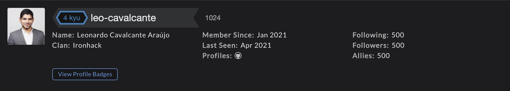
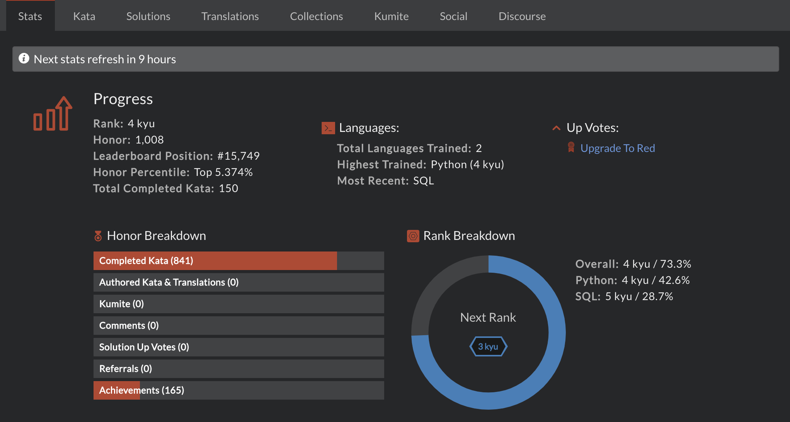

# CODEWARS
**Leonardo Cavalcante Araújo**

*Last update: April 16th 2021 at 15h*

## Content
- [Summary](#summary)
- [Statistics](#statistics)
- [Other Informations](#other-informations)
- [Links](#links)

 

## Summary

 

## Statistics

 

## Other Informations
Languages trained so far:
- Python
- SQL

Nevertheless, I have also learned how to code in C and a bit in Java and R.

 

## Links
Here you may find the link for my personal profile on CODEWARS and my LinkedIn profile.

**[leo-cavalcante profile in CODEWARS](https://www.codewars.com/users/leo-cavalcante)**

**[LinkedIn Profile](https://www.linkedin.com/in/leo-cavalcante)**