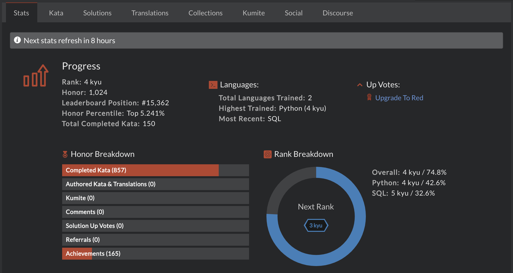

# **CODEWARS** by Léo
**Leonardo Cavalcante Araújo**

*Last update: April 16th 2021 at 15h*

## Badge
My most recent badge:

<a href="https://www.codewars.com/users/leo-cavalcante/">

</a>

*PS.: you may click on the photo to consult my profile with my most recent Badge and Stats.*

## Content
- [Badge](#badge)
- [Summary](#summary)
- [Statistics](#statistics)
- [Profile Badges](#profile-badges)
- [Other Informations](#other-informations)
- [Other Links](#other-links)

 

## Summary
Codewars is an online platform for practicing coding through gamified exercises.

I joined the platform recently to develop and improve my skills in coding.

**Currently, I use the platform to prepare myself for Technical interviews for Data Analyst roles in Paris.**

Here's a summary of my **CODEWARS** profile:

 

## Statistics
Here's some more detail about my main achievements in this platform:

 

## Other Informations
Languages trained at **CODEWARS** so far:
- Python
- SQL

Nevertheless, I have also learned how to code in **C** (in engineering school), notions in **Java** (from elective course), **EXCEL-VBA** (online courses and on-job practice) and **R** (from online courses).

 

## Links
Here you may find the link for my personal profile on CODEWARS and my LinkedIn profile.

**[leo-cavalcante profile in CODEWARS](https://www.codewars.com/users/leo-cavalcante)**

**[LinkedIn Profile](https://www.linkedin.com/in/leo-cavalcante)**